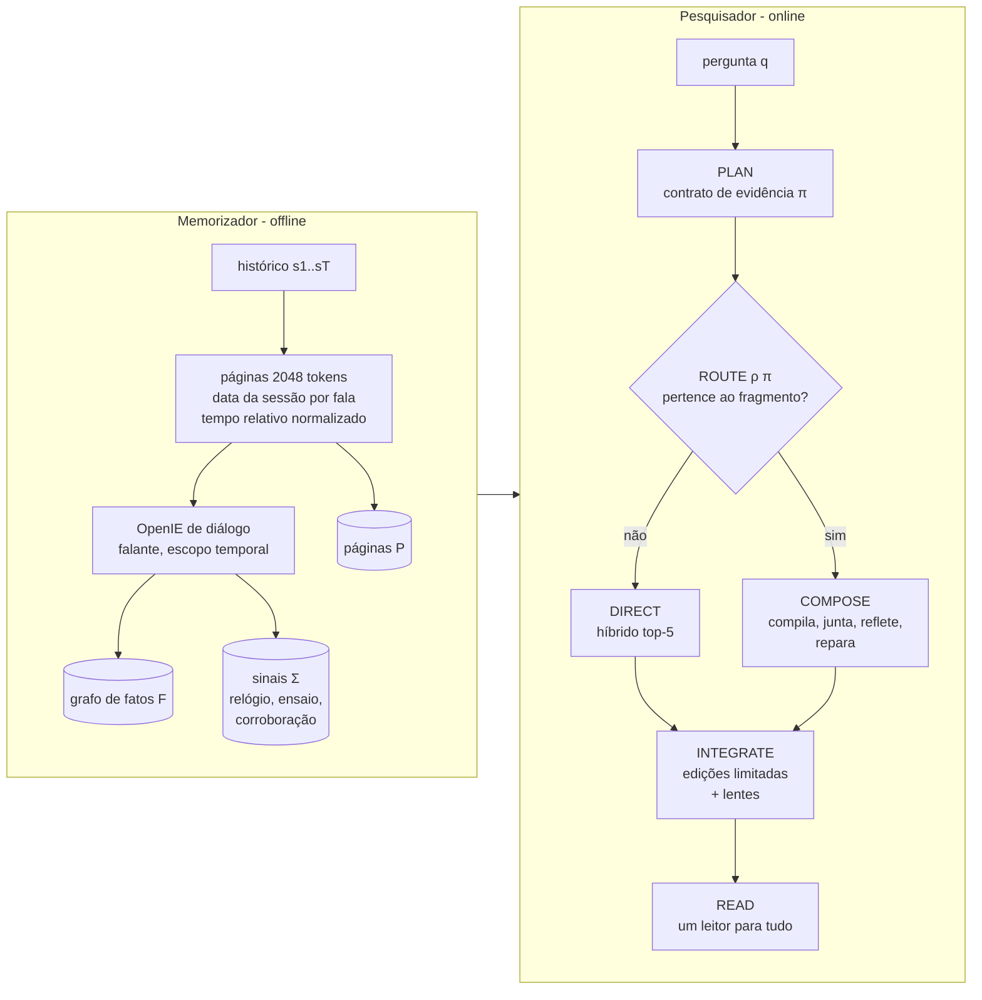

# WitnessRAG: como o método funciona, do começo ao fim

Documento didático do estado atual (23/09/2026). Descreve o caminho real de
uma pergunta no código, a versão agnóstica à categoria (sem ler o rótulo do
LoCoMo), as lentes de memória e o desenho experimental. O texto de artigo
correspondente, em inglês, está em [paper/witnessrag-method.tex](paper/witnessrag-method.tex)
(compile `paper/preview.tex` para ver com figura e algoritmo).

Documentos anteriores continuam válidos como histórico:
[proposta.md](proposta.md) (teoria das testemunhas),
[witness-atual.md](witness-atual.md) (estado de 14/09, antes do controlador seletivo).

---

## 0. O método em uma página

**Ideia central.** Uma pergunta sobre a memória de um agente é respondida
melhor quando o contexto entregue ao leitor contém uma **testemunha**: um
conjunto mínimo de fatos armazenados que, juntos, demonstram a resposta. O
WitnessRAG tenta montar essa testemunha quando a pergunta é do tipo que admite
uma, e cai numa recuperação híbrida forte quando não é.

**Divisão de trabalho (herdada do GAM).**

- **Memorizador** (offline, uma vez por memória): guarda tudo em páginas,
  extrai fatos para um grafo e calcula sinais de memória.
- **Pesquisador** (online, por pergunta): planeja, roteia, compõe
  testemunhas quando cabe, edita um número limitado de posições do contexto
  híbrido e chama um único leitor.



**O que chama o LLM e o que é simbólico.**

| etapa | chamada de LLM? | o que faz |
|---|---|---|
| extração (offline) | sim, 2 por janela de 512 tokens | entidades, depois triplas com falante e tempo |
| sinais (offline) | não | datas, ensaio, corroboração, excitação emocional |
| PLAN | **sim, 1** | escreve o contrato de evidência só a partir do texto da pergunta |
| ROUTE | não | função determinística do contrato |
| COMPOSE: compilar | sim, 1 (só na rota COMPOSE) | pergunta → consulta conjuntiva |
| COMPOSE: juntar, refletir, reparar | não | busca de testemunhas, teste de suficiência, sondas |
| lentes | não | recência/estabilidade, saliência, confiança |
| READ | sim, 1 | leitor único, igual para todos os métodos |

Custo online: **2 chamadas** por pergunta na rota DIRECT e **3** na rota
COMPOSE. O controlador antigo (que lia o rótulo) custava 1 e 2.

---

## 1. De onde vem o desenho

### 1.1 GAM: memória "just-in-time"

O GAM (Yan et al., 2025, arXiv:2511.18423) critica as memórias montadas "ahead
of time" (resumos, grafos comprimidos), que perdem detalhes que uma pergunta
futura vai precisar. A proposta dele: guardar o histórico completo num *page
store* e fazer o trabalho pesado na hora da pergunta, com um pesquisador que
**planeja** (necessidades de informação e ferramentas: keyword, vector,
page_id), **busca**, **integra** (um resumo factual) e **reflete** (um LLM diz
se a informação basta; se não, gera novas perguntas de busca, até 3 rodadas).

Confirmei que o repositório foi montado sobre essa base: a suíte replica o
protocolo do GAM quase item por item (LoCoMo com as 4 categorias e F1 +
BLEU-1, HotpotQA 56K/224K/448K tokens, RULER 128K com Retri./MT/AGG./QA,
NarrativeQA, Qwen2.5-14B-Instruct, BGE-M3, páginas de 2.048 tokens e top-5).
Dois detalhes para conferir: o código cita "ZeroMem" como origem do protocolo
de 2.048 tokens, e o `benchmark-suite.md` fala em 56k/224k/448k *passagens*,
enquanto o script usa `--corpus-token-budget`, isto é, *tokens*, como no GAM.

**O que o WitnessRAG herda e o que muda.**

| | GAM | WitnessRAG |
|---|---|---|
| offline | memos + páginas | páginas + grafo de fatos + sinais |
| planejar | info-needs + ferramentas | contrato de evidência (forma, operador, escopo, tempo, entidades, necessidades, **lentes**) |
| buscar | keyword, vector, page-id | híbrido RRF (vector + keyword) e, na rota COMPOSE, junção no grafo |
| integrar | LLM escreve um resumo | edição limitada do contexto híbrido (sem texto gerado) |
| refletir | LLM julga suficiência, até 3 rodadas | **teste simbólico**: a junção fechou com uma testemunha seletiva? |
| repetir | nova pergunta r' | no máximo uma sonda dirigida (acordo entre sondas ou lacuna da junção) |
| chamadas online | várias por rodada | 2 ou 3 no total |

A frase para o artigo: *o GAM integra e reflete com o modelo; o WitnessRAG
compõe e reflete com lógica*.

### 1.2 O artigo EMAS (Bridging Reflective and Semantic Memory)

O seu artigo pontua cada memória com
`Score = R · [β·S + (1−β)·A]`: relevância R como filtro multiplicativo,
estabilidade S (curva de Ebbinghaus, `S = exp(−(t−τ)/s)`, `s = s0 + α·n`) e
afetividade A (utilidade aprendida por reflexão, `A(t+1) = A(t) + λ(t)`). No
WitnessRAG essas grandezas viram **lentes** que o próprio plano liga ou
desliga por pergunta (Seção 3.5), em vez de pesos fixos para todas as
perguntas.

---

## 2. Memorizador (offline)

### 2.1 Páginas

Cada conversa do LoCoMo vira páginas de até 2.048 tokens. Cada página começa
com a data da sessão e cada fala carrega o seu **relógio de referência**
τ(u), a data da sessão em que foi dita. Com `--temporal-annotations`, um
normalizador determinístico acrescenta, ao lado da fala original, o valor
absoluto de expressões relativas:

```
Session date: 1:56 pm on 8 May, 2023
[D1:3 date=1:56 pm on 8 May, 2023] Caroline: I went to a LGBTQ support group yesterday ...
[D1:3 temporal] reference_time=2023-05-08; "yesterday"=7 May 2023
```

Nada aqui lê perguntas, respostas ou anotações. Uma observação útil: uma
conversa inteira tem entre ~13 mil e ~25 mil tokens, ou seja, **~7 a 13
páginas**. O pool de 20 candidatos cobre a conversa inteira; o problema real
de recuperação no LoCoMo é **escolher quais 5 de ~10 páginas mostrar**. Isso
explica por que editar uma ou duas posições tem efeito grande.

### 2.2 Fatos e grafo

A extração é em dois passos (entidades, depois triplas) sobre janelas de 512
tokens com sobreposição de 64 e no máximo 40 triplas por janela; cada fato
aponta para a página-mãe. O prompt de diálogo resolve "I/my" para o falante,
nomeia parentes pelo dono ("Caroline's grandmother") e adiciona o tempo como
quarto elemento. Um exemplo ilustrativo do formato:

```
("Caroline", "attend", "LGBTQ support group", "7 May 2023")
```

Um fato é `f = (sujeito, relação, objeto, página, tempo, confiança)`, com
confiança 0,9 para uma extração. Entidades são agrupadas em **clusters de
identidade** (contenção lexical confirmada por similaridade ≥ 0,80, para que
"Juan Courten" e "Juan de Courten" sejam a mesma coisa) e relações em
**famílias morfológicas** (`paint`/`painted`). A mesma base de fatos é usada
por GraphRAG, HippoRAG e HippoRAG 2: a comparação entre métodos não mistura
extratores diferentes.

### 2.3 Sinais de memória (sem LLM)

Calculados uma vez por corpus em `wrag/witness/lenses.py::MemorySignals`:

- **relógio** `[t0, t_now]`: primeira e última sessão. `t_now` é o "presente"
  em que as perguntas são feitas;
- **ensaio** `n(s, r)`: em quantas páginas o mesmo (sujeito canônico, relação)
  é reafirmado. Um fato repetido em várias sessões é mais estável;
- **corroboração** `m(f)`: quantas extrações sustentam a mesma tripla canônica;
- **excitação emocional** `α(u)` de cada fala (léxico de arousal,
  intensificadores e exclamações), calculada sob demanda.

---

## 3. Pesquisador (online), passo a passo

### 3.1 A linha de base que tudo edita

Toda pergunta começa com a recuperação híbrida: BGE-M3 e BM25 fundidos por
RRF (k = 60), pool de 20, cortado em k = 5. Esse contexto `B_k(q)` é o que o
leitor veria sem WitnessRAG. **Tudo o que o pesquisador faz é editar poucas
posições do fim de `B_k`.** Esse é o princípio que protege o desempenho.

### 3.2 PLAN: o contrato de evidência

Antes: o controlador seletivo fazia
`if question.qtype != "multi-hop": return hybrid_top5`. O rótulo vinha do
benchmark e não existe em produção.

Agora: uma chamada de planejamento lê **apenas o texto da pergunta** e escreve
um contrato num vocabulário fechado, sem nenhuma palavra de categoria de
benchmark:

| campo | valores | pergunta que responde |
|---|---|---|
| `answer_form` | entity, set, count, time, duration, yes_no, choice, description | que forma tem a resposta? |
| `operator` | lookup, aggregate, join, compare, temporal, abduce | que raciocínio vem depois da busca? |
| `evidence_scope` | single, multiple | a resposta precisa de declarações feitas em mais de um lugar ou ocasião? |
| `time` | focus: none, when, first, last, window, current, duration; anchor: período copiado da pergunta | como o tempo entra? |
| `focus_entities` | nomes copiados da pergunta | de quem é a pergunta? |
| `info_needs` | até 4 perguntas de busca | o que procurar (como os info-needs do GAM) |
| `lenses` | temporal: none/recent/early/anchor; salience; confidence | que sinais de memória devem reordenar a evidência? |

Exemplos **ilustrativos** do que se espera do planejador (não são saídas
medidas):

```json
// "What activities does Melanie partake in?"
{"answer_form":"set","operator":"aggregate","evidence_scope":"multiple",
 "time":{"focus":"none","anchor":""},"focus_entities":["Melanie"],
 "info_needs":["Which activities did Melanie mention doing?"],
 "lenses":{"temporal":"none","salience":false,"confidence":false}}

// "When did Caroline go to the LGBTQ support group?"
{"answer_form":"time","operator":"temporal","evidence_scope":"single",
 "time":{"focus":"when","anchor":""},"focus_entities":["Caroline"], ...}

// "Would Caroline pursue writing as a career option?"
{"answer_form":"yes_no","operator":"abduce","evidence_scope":"multiple", ...}

// "Which country was Jolene located in during the last week of August 2023?"
{"answer_form":"entity","operator":"lookup","evidence_scope":"single",
 "time":{"focus":"window","anchor":"the last week of August 2023"},
 "lenses":{"temporal":"anchor","salience":false,"confidence":false}, ...}
```

Salvaguardas (em `wrag/witness/contract.py`): valores fora do vocabulário
passam por uma tabela de sinônimos (`list → set`, `chain → join`) ou caem no
padrão; JSON inválido ou bloqueado pelo filtro do Azure vira contrato
inválido, que **sempre** vai para a rota DIRECT (a linha de base). Um
bloqueio do contrato não tira a pergunta da avaliação: ela segue pela rota
híbrida, e o denominador fica igual ao do controlador rotulado.

### 3.3 ROUTE: pertença ao fragmento, não classificação de tipo

A rota é uma função pura do contrato:

```
COMPOSE  se  operator ∈ {aggregate, join, compare}
         e   evidence_scope = multiple
         e   answer_form ∈ {entity, set, count, description}
DIRECT   caso contrário (inclusive contrato inválido)
```

Por que essa regra e não "detectar multi-hop"? Porque ela vem do que o
executor de testemunhas **sabe certificar**: consultas conjuntivas positivas
cuja variável de resposta é uma entidade (ou o conjunto delas).

| caso | fragmento? | por quê | rota |
|---|---|---|---|
| lookup de um fato | trivialmente | a testemunha é uma página, e o híbrido já a encontra | DIRECT |
| agregar itens citados em várias sessões | sim | conjunto de atribuições, uma testemunha por item | COMPOSE |
| cadeia / interseção ("both", "in common") | sim | junção com variável compartilhada | COMPOSE |
| tempo ("when", "how long") | não | exige aritmética temporal, não junção | DIRECT + memória temporal |
| abdução ("would", "likely") | não | a resposta não é derivável de fatos armazenados | DIRECT + leitor |
| sim/não | não | não há variável de resposta para ligar | DIRECT |

Dá para vender isso no artigo como *routing by fragment membership*: o
sistema não pergunta "que tipo de pergunta é esta?", pergunta "existe uma
testemunha possível para ela?". Diferente do Adaptive-RAG (Jeong et al., 2024),
que treina um classificador de complexidade, não precisa de dados rotulados.

### 3.4 COMPOSE: compor, refletir, reparar

Só nesta rota há uma segunda chamada: a **compilação**.

1. **Compilar.** O LLM traduz a pergunta numa consulta conjuntiva com até 4
   átomos, variável de resposta `?x` e agregação em {none, set, count}. O prompt
   sugere as 40 relações e 20 entidades do grafo mais próximas da pergunta,
   para evitar predicados que nenhum fato instancia.
2. **Aterrar.** Cada átomo `r(t, t')` recebe fatos candidatos com
   `g = (0,45·sim_relação + 0,35·sim_constante + 0,20·sim_verbalização)/Σpesos`,
   exigindo `sim_relação ≥ 0,65`. Cada constante liga-se a até 5 clusters com
   similaridade ≥ 0,55, e o fato só é admitido se o argumento cair num deles.
   A direção da relação nunca é invertida por similaridade.
3. **Juntar.** Busca em feixe (400) com atribuição consistente: a mesma
   variável recebe o mesmo cluster em todos os átomos. Saem testemunhas
   mínimas, com `score(W) = Π g` e suporte da resposta
   `supp(a) = max_W score(W)·Π c_f` (duplicar uma prova não aumenta o suporte).
4. **Refletir, simbolicamente.** Onde o GAM pergunta a um LLM "já basta?", aqui
   o teste é a própria junção:

   ```
   y(q) = 1  sse  existe testemunha
                 e |respostas| ≤ 3 e |testemunhas| ≤ 3 e sem cortes na busca
                 e supp(melhor) ≥ 0,45 e as testemunhas usam ≤ 2 páginas
   ```

   Muitas respostas, muitas provas duplicadas ou busca truncada indicam que o
   plano não é seletivo, e aí a testemunha não pode deslocar a evidência
   híbrida. Com `y = 1`, testemunhas **inteiras** entram nas duas últimas
   posições.
5. **Reparar** (quando `y = 0`), no máximo uma vez:
   - **sondas com acordo**: a consulta de fallback e os átomos verbalizados
     viram buscas independentes; uma página só entra (na 5.ª posição) se pelo
     menos duas sondas a recuperarem no top-10;
   - **sonda da lacuna**: se a junção parou num átomo com entidade ligada `e`
     e relação faltante `r`, busca-se "e r" e entra a primeira página nova que
     menciona `e` literalmente.
   Reparos são hipóteses, nunca provas, e ficam marcados assim no diagnóstico.

**Exemplo trabalhado** (o do `tests/test_witness.py`): fatos e1 Ana trabalha na
Atlas, e2 Atlas fica em Recife, e3 Ana pesquisa Óptica, e4 Bruno trabalha na
Atlas, e5 Bruno pesquisa Óptica. Para "Onde fica o empregador da Ana?":
`trabalha_em(Ana, ?y) ∧ localizada_em(?y, ?x)`. A junção liga `?y = Atlas`
pelo e1, depois `?x = Recife` pelo e2: testemunha {e1, e2}, páginas p0 e p1.
Se p0 e p1 não estavam no top-5 híbrido, elas entram nas duas últimas
posições. Para "Quem trabalha na Atlas e pesquisa Óptica?", a interseção exige
a **mesma** pessoa nos dois átomos: {e1, e3} testemunha Ana e {e4, e5}
testemunha Bruno. Recuperar "um funcionário da Atlas" e "alguém que pesquisa
Óptica" separadamente não responde nada.

### 3.5 Lentes de memória (a parte nova de métricas)

As lentes reordenam **apenas a cauda** do contexto, e só as que o contrato
pediu. Para uma página candidata p:

```
s(p) = R̃(p) · (1 + β · Σ_{lentes ligadas} Φ(p))
```

`R̃` é a relevância híbrida normalizada no pool (min–max). Ela é
**multiplicativa**, como no artigo EMAS: uma página irrelevante nunca sobe por
ser recente ou emocional. β = 1.

**Lente temporal Φ_T**, usando o relógio de referência:

- `recent` (atual, "currently", "now"): retenção de Ebbinghaus
  `exp(−(t_now − τ)/s)`, com estabilidade `s = s0 + α·(n − 1)` e `n` = ensaio
  do fato sobre a entidade de foco. É a equação 1 do artigo EMAS, com `n`
  contando reafirmações no diálogo em vez de recuperações. Exemplo com
  `s0 = α = 30` dias: um fato dito uma vez há 90 dias tem `exp(−3) ≈ 0,05`; o
  mesmo fato reafirmado em 3 sessões tem `s = 90` e `exp(−1) ≈ 0,37`;
- `early` ("first"): `exp(−(τ_min − t0)/s0)`, favorece as primeiras sessões;
- `anchor` ("during the last week of August 2023"): a âncora é convertida num
  intervalo I (aqui, 25–31/08/2023) e `Φ = exp(−d(τ, I)/w)`, com `w = max(7,
  |I|/2)` dias. Os tempos da página incluem as datas de sessão **e** os
  extremos das normalizações (`start=`/`end=`), que são tempos de evento.

Assim a recência faz parte do mecanismo temporal, como você sugeriu: o mesmo
relógio que normaliza "yesterday" para o leitor também ancora a busca.

**Lente de saliência Φ_A.** Experiências emocionalmente intensas são
consolidadas preferencialmente (McGaugh, 2004). Para falas da entidade de foco
(ou que a mencionam), `Φ_A = max_u (1 − e^{−ε(u)/2}) · (½ + ½·min(1,
termos em comum com a pergunta / 2))`. Uma fala emocional de outra pessoa vale
zero.

**Lente de confiança Φ_C.** `Φ_C = max_f (1 − (1 − c_f)^{m(f)}) · cos⁺(needs, f)`
sobre fatos da página que falam das entidades de foco: fatos corroborados por
várias extrações e parecidos com as necessidades de informação do contrato.

**A confiança já modela a afetividade?** Não, e vale dizer isso no artigo.
São eixos diferentes:

| eixo | pergunta que responde | exemplo |
|---|---|---|
| epistêmico (confiança) | este registro é confiável? | "Caroline mora em Boston", extraído 3 vezes: muito confiável, emocionalmente neutro |
| temporal (estabilidade) | este registro ainda vale agora? | o emprego de 8 meses atrás, nunca reafirmado, decaiu |
| pragmático/afetivo (saliência) | isto importa para a pessoa? | "foi o dia mais difícil da minha vida", dito uma vez, pouco corroborado, altamente saliente |

No artigo EMAS a afetividade é **utilidade aprendida por feedback** (λ). No
teste de um benchmark não há feedback, e atualizar entre perguntas faria a
resposta da pergunta 300 depender das 299 anteriores (por isso a memória é
restaurada a cada pergunta). A formulação elegante: **a saliência é a
*priori* da afetividade**; num agente em produção, a atualização natural é
`λ_f = +1` quando o fato participa de uma testemunha entregue de uma resposta
confirmada. Isso liga o seu trabalho anterior ao WitnessRAG sem contaminar o
protocolo.

**Como a lente troca uma página.** Um candidato p⁺ só substitui a página mais
fraca da cauda p⁻ se (i) o ganho de lente dele for maior e (ii)
`s(p⁺) > 1,1 · s(p⁻)`, no máximo `L` trocas (padrão 1). Páginas colocadas pela
rota COMPOSE são protegidas. Sem lente ligada, a função é a identidade (teste
`test_rerank_is_identity_without_lens_gain_and_bounded_otherwise`).

### 3.6 INTEGRATE: o invariante que protege o desempenho

- testemunha: até 2 posições (as últimas);
- sonda com acordo ou sonda da lacuna: 1 posição (a última);
- lentes: até L posições não protegidas.

Logo `|C(q) \ B_k(q)| ≤ max(2, L)` e as primeiras `k − max(2, L)` páginas do
híbrido são **sempre** entregues. Um erro do planejador ou do executor custa,
no pior caso, duas posições da cauda.

### 3.7 READ

Um único leitor para todas as rotas e todos os métodos (`--evidence-reader`):
ele identifica a operação pedida (entidade, opção, inferência, lista, contagem
distinta, data, intervalo, duração), lê a visão temporal (cada fala com a
data e a normalização) e devolve um trecho curto; números e sim/não são
canonicalizados. Na configuração atual o leitor **já não usa a categoria**:
com `--evidence-reader`, o template é o mesmo para todas as perguntas. O único
uso da categoria era o `if` do roteamento, que agora é substituído pelo
contrato. Sem `--evidence-reader`, o `reader.py` voltaria a escolher o
template pela categoria do LoCoMo; por isso o `wrag.pilot` recusa
`--agnostic-router` no LoCoMo sem `--evidence-reader`.

---

## 4. Onde está a "reflexão"

Três lugares, todos sem chamada extra de LLM:

1. **Suficiência** `y(q)`: a junção fechou com uma testemunha seletiva? (é o
   InfoCheck do GAM, feito por lógica);
2. **Pergunta de seguimento**: a lacuna da junção (qual átomo falhou, sobre
   qual entidade já ligada) vira a sonda "e r" (é o FollowUpRequest do GAM,
   feito pela estrutura da falha);
3. **Acordo**: uma página só entra por sonda se duas formulações diferentes do
   plano concordarem nela (proteção contra um predicado alucinado).

Profundidade de reflexão fixa em 1, por custo. Uma extensão natural para o
artigo (RQ4) é permitir mais rodadas e medir a curva custo × F1, como a
Figura 2 do GAM.

---

## 5. Custo por pergunta

| sistema | chamadas online | observação |
|---|---|---|
| híbrido | 1 | só o leitor |
| controlador rotulado (seletivo) | 1 + 1[multi-hop] ≈ 1,18 no LoCoMo | lê o rótulo (privilegiado) |
| **WitnessRAG agnóstico** | 2 + 1[COMPOSE] ≈ 2,2 | uma chamada de planejamento a mais |
| + lentes | igual | lentes não chamam LLM |
| GAM | planejar + integrar + checar + seguimento, até 3 rodadas | pesquisa profunda |

O preço de não ler o rótulo é exatamente **uma chamada curta** por pergunta.
Uma variante mais barata (fundir contrato e compilação numa chamada só) é
possível, mas quebraria a reutilização do cache descrita abaixo; fica como
ablação futura.

---

## 6. Por que o desempenho se preserva (e como medir antes de gastar)

**Proposição (equivalência de rota).** Com decodificação determinística ou
cache de respostas compartilhado, e lentes desligadas: se a rota do contrato
coincide com a rota rotulada, o contexto e a resposta são **idênticos** aos do
controlador rotulado. Motivo: a rota COMPOSE chama exatamente
`_retrieve_selective(..., compose=True)`, a mesma função com os mesmos
argumentos; o prompt da compilação depende só da pergunta e do vocabulário do
grafo; o do leitor, só da pergunta e do contexto. Com o mesmo `CACHE_DIR`, até
as chamadas saem do cache.

Consequência, para qualquer métrica por pergunta em [0, 1]:

```
|F1_agnóstico − F1_rotulado| ≤ |D_eff| / N ≤ (perguntas em que as rotas discordam) / N
```

onde `D_eff` são as discordâncias em que algum dos dois controladores de fato
editou o contexto híbrido. Isso é **mensurável antes da rodada completa**, com
uma chamada curta por pergunta (`scripts/audit-router.py`).

Honestidade sobre o limite: **não é possível garantir o mesmo número sem
rodar**. O que o desenho garante é (i) identidade exata onde as rotas
concordam, (ii) edição de no máximo 2 posições onde discordam, e (iii) uma
cota superior mensurável e barata. Duas observações que tornam a diferença
provavelmente pequena: uma pergunta não multi-hop mandada para COMPOSE quase
sempre volta ao híbrido, porque o controlador é conservador; e uma multi-hop
mandada para DIRECT só perde nas perguntas em que o controlador rotulado de
fato mudou o contexto.

Validação feita aqui (backend `stub`, LoCoMo conv-26, 152 perguntas): rodando
o controlador rotulado e o agnóstico separadamente, **100% das perguntas com
rota concordante tiveram contexto idêntico**. Os números de F1 do `stub` não
têm valor científico; só o mecanismo foi validado.

---

## 7. Desenho experimental (inspirado no GAM)

**Perguntas de pesquisa.**

- **RQ1** planejar sem rótulo preserva a eficácia do controlador rotulado?
  (concordância de rota, `D_eff`, ΔF1 pareado com IC95%, custo)
- **RQ2** como o WitnessRAG se compara a sistemas sem memória, baseados em
  grafo e baseados em memória? (tabela no formato da Tabela 1 do GAM)
- **RQ3** quanto vale cada componente? (roteamento, composição, cada lente)
- **RQ4** quanto custa, e como a eficácia muda com o orçamento de edição L?

**Benchmarks.** LoCoMo (10 conversas, 1.540 perguntas: 841 single-hop, 282
multi-hop, 321 temporal, 96 open-domain; categoria usada **só** para reportar),
HotpotQA 56K/224K/448K tokens, RULER 128K, NarrativeQA.

**Braços pareados** (mesmo corpus, fatos, embedder, leitor, k = 5, T = 0,
semente 42 e cache):

| braço | roteamento | isola |
|---|---|---|
| Hybrid | nenhum | a linha de base `B_k` |
| Rotulado | rótulo do benchmark (privilegiado) | referência superior de roteamento |
| **WitnessRAG** | contrato | sistema principal |
| + lentes | contrato + Λ | contribuição das lentes |
| + uma lente | contrato + uma lente | temporal, saliência, confiança isoladas |
| compose-all | planeja e manda tudo para COMPOSE | valor do roteamento |
| direct-all | planeja e manda tudo para DIRECT | custo do planejador sem composição |

**Métricas.** LoCoMo: F1 oficial e BLEU-1 por categoria; HotpotQA/NarrativeQA:
F1; RULER: acurácia por tarefa. Recuperação: all-recall@5. Fidelidade: taxa de
testemunha completa entregue. Custo: chamadas, tokens, latência. Roteamento:
concordância e `D_eff`.

**Controle de vazamento.** Planejador e compilador nunca veem resposta,
evidência anotada ou categoria (há teste para isso). Os limiares do
controlador foram ajustados durante o desenvolvimento na primeira conversa
(conv-26); recomendo reportar também as **nove conversas restantes
separadamente** como verificação fora da amostra de desenvolvimento.

---

## 8. Como rodar

```bash
# 1) testes (sem servidor)
python -m pytest -q tests/test_agnostic_router.py

# 2) auditoria barata do roteador: só o contrato, 1 chamada curta por pergunta.
#    As chamadas ficam no cache e são reaproveitadas pela rodada completa.
WRAG_LLM_BACKEND=azure WRAG_AZURE_DEPLOYMENT=gpt-4-1-mini-petrobras \
WRAG_CACHE_DIR=runs/.cache/witness-azure \
python scripts/audit-router.py --output runs/router-audit
#    → runs/router-audit/router_audit.{md,json,csv}: concordância por categoria
#      e a cota |ΔF1| ≤ taxa de discordância

# 3) rodada completa agnóstica (mesmo cache da rodada seletiva)
PROFILE=agnostic bash scripts/run-witness-agnostic-locomo.sh
PROFILE=agnostic-lenses bash scripts/run-witness-agnostic-locomo.sh
# ablações: lens-temporal | lens-salience | lens-confidence | compose-all | direct-all

# 4) relatório pareado contra o controlador rotulado
python scripts/router-report.py \
  --agnostic runs/witness-suite-locomo-azure-agnostic \
  --labelled runs/witness-suite-locomo-azure-selective
```

Flags novas em `wrag.pilot`: `--agnostic-router`, `--memory-lenses`,
`--lenses temporal,salience,confidence`, `--lens-max-swaps N`,
`--route-override compose|direct`. O controlador `selective-v1` continua
intacto: sem `--agnostic-router`, nada muda.

---

## 9. Limitações e riscos

- **Concordância do planejador é empírica.** O prompt do contrato nunca viu
  perguntas do LoCoMo nem nomes de categoria; se a auditoria mostrar baixa
  concordância numa categoria, ajustar o prompt olhando as discordâncias é
  legítimo em desenvolvimento, mas deve ser feito na conversa de
  desenvolvimento e declarado.
- **Lentes não são calibradas.** β, δ, `s0`, α e o léxico de arousal são
  valores razoáveis, não ajustados. Por isso as lentes são uma ablação (RQ3),
  desligadas no perfil "mesmo desempenho".
- **Saliência por léxico** é um proxy; um classificador de emoção ou um
  escore de importância gerado na memorização (como em Generative Agents) é o
  passo seguinte.
- **Datas de página** misturam datas de sessão e datas de evento normalizadas;
  páginas de 2.048 tokens cobrem 2–3 sessões, então a lente temporal tem
  granularidade de página, não de fala.
- **Um contrato bloqueado pelo filtro** vai para DIRECT; isso é seguro, mas
  entra na contagem de discordância.

---

## 10. Mapa conceito ↔ código

| conceito | onde |
|---|---|
| páginas, relógio por fala, normalização temporal | `wrag/locomo.py` (`convert`, `_temporal_annotation`) |
| OpenIE de diálogo, janelas | `wrag/ie.py`, `wrag/prompts.py::OPENIE_DIALOGUE_TEMPLATE` |
| grafo, clusters de identidade, famílias de relação | `wrag/graph.py` |
| híbrido RRF | `wrag/methods/dense.py::HybridRetriever` |
| contrato de evidência, rota | `wrag/witness/contract.py`, `wrag/prompts.py::CONTRACT_TEMPLATE` |
| controlador agnóstico | `wrag/methods/witnessrag.py::_retrieve_agnostic` |
| rota COMPOSE (mesma do seletivo) | `wrag/methods/witnessrag.py::_retrieve_selective(compose=...)` |
| compilação | `wrag/witness/query.py::compile_query` |
| aterramento e junção | `wrag/witness/search.py` |
| suporte das respostas | `wrag/witness/provenance.py::score_answers` |
| sondas com acordo | `wrag/methods/witnessrag.py::_selective_probe_tail` |
| relógio, âncoras | `wrag/witness/timeline.py` |
| lentes e sinais | `wrag/witness/lenses.py` |
| leitor | `wrag/eval/reader.py`, `QA_EVIDENCE_TEMPLATE` |
| auditoria e relatório do roteador | `scripts/audit-router.py`, `scripts/router-report.py` |
| rodada Azure agnóstica | `scripts/run-witness-agnostic-locomo.sh` |
| testes | `tests/test_agnostic_router.py` |
